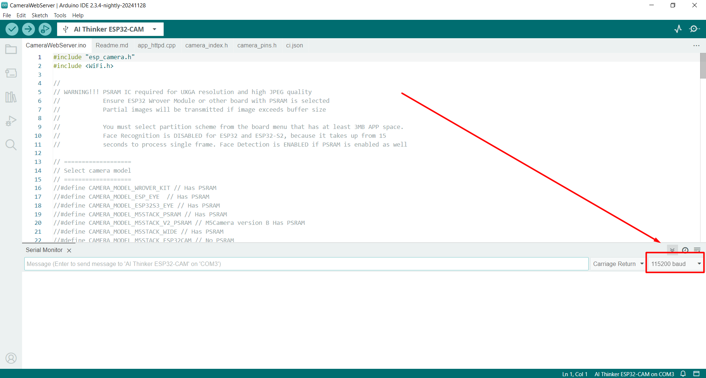
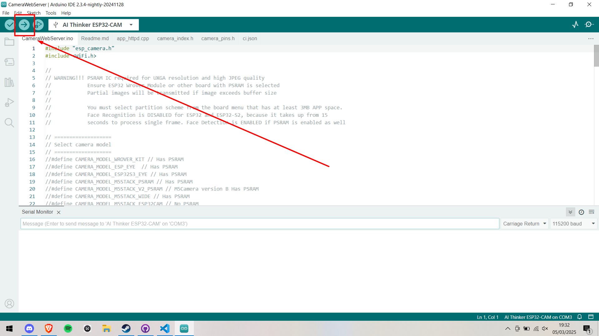
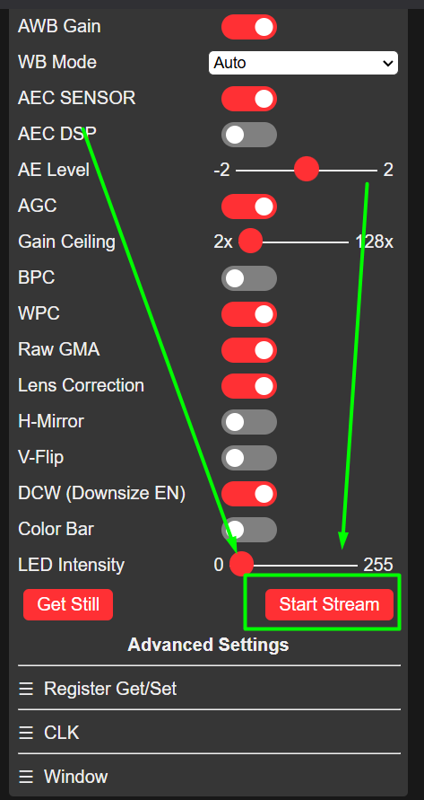

# How to Use it?
1) Abrir Arduino IDE (Porque arduino? porque la placa de la camara usa C++ para funcionar)

2) Abrir el archivo facilitado (CameraWebServer.ino)
3) Seleccionar la placa "AI Thinker ESP32-CAM"
4) Abrir "Serial Monitor" y poner la velocidad del reloj en 115200 baud

5) Iniciar programa

6) Abrir el web server usando la direccion ip del "Serial Monitor"
7) Bajar el scroll y darle al boton de "Start Stream"
