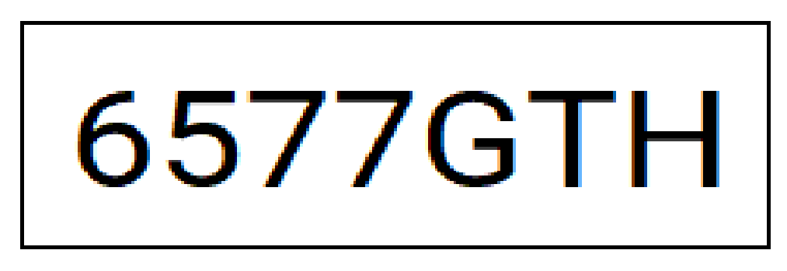

# How to Use it?

## Python Dependences
```bash
pip install opencv-python
```
```bash
pip install numpy
```

```bash
pip install pytesseract
```

## Program Dependences
[Tesseract OCR](https://github.com/tesseract-ocr/tesseract/releases/tag/5.5.0)


# Run Program
## Run Arduino IDE camera Example
## Run program on Powershell
```bash
python DetectorMatriculas.py <ip>
```

